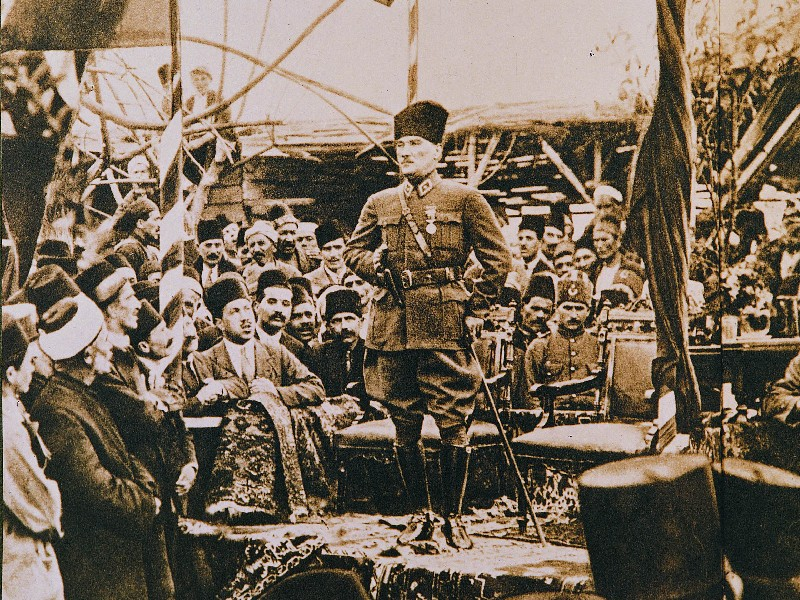

# Atatürk Resimleri API

Atatürk'ün 100 farklı resmi ile oluşturulmuş bir JSON API.

## Basit Kullanım

```bash
GET https://ataturk-resimleri-api.herokuapp.com/
```

## Sonuç

```json
{
    "id": 50,
    "image":"https://github.com/orhanemree/ataturk-resimleri-api/blob/main/public/images/50.png"
}
```

<br>

## Endpointler

|Endpoint|Sonuç|
|--------|-----|
|/|JSON biçiminde rastgele bir sonuç döndürür.|
|/resim|Rastgele bir resim döndürür.|
|/:id|Girilen id'ye göre JSON biçiminde sonuç döndürür.|
|/:id/resim|Girilen id'ye göre bir resim döndürür.|

<br>

## Örnekler
```bash
GET https://ataturk-resimleri-api.herokuapp.com/75
````

```json
{
    "id": 75,
    "image":"https://github.com/orhanemree/ataturk-resimleri-api/blob/main/public/images/75.png"
}
```
<br>

```bash
GET https://ataturk-resimleri-api.herokuapp.com/75/resim
````

</img>


## Lisans
Atatürk Resimleri API [Apache License 2.0](https://github.com/orhanemree/ataturk-resimleri-api/blob/main/LICENSE) ile lisanslanmıştır.